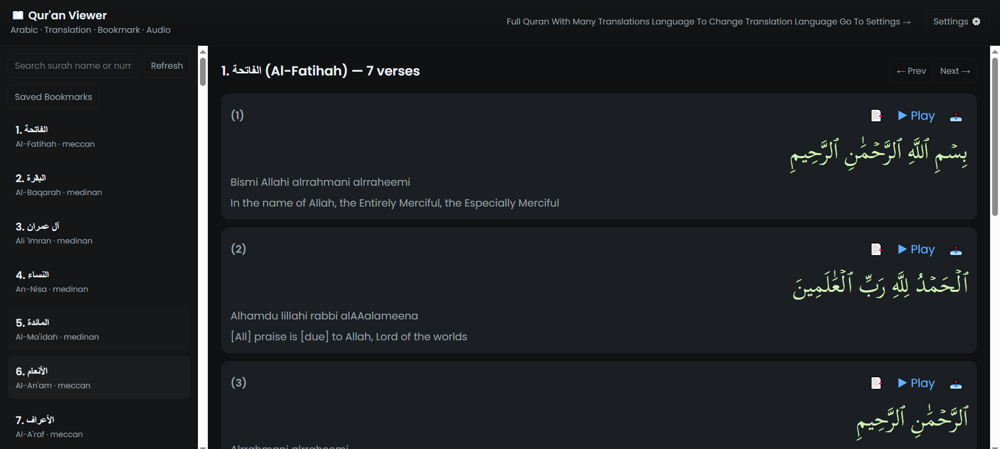

# NoorAlQuran

A fully featured, responsive web-based Qur’an application built with HTML, CSS, and JavaScript.

---

## Features

### Complete Qur’an Access
- Browse and read the entire Qur’an with all 114 Surahs and their respective Ayahs.
- Navigate quickly between Surahs using an intuitive menu or search function.

### Multiple Translation Languages
- Supports numerous translation languages side-by-side with the original Arabic text.
- Easily switch between translations without reloading the app.
- View translations by various well-known translators for better understanding.

### Audio Recitations
- Play the exact recitation of each Ayah with a dedicated play button beside it.
- Pause, resume, and replay audio seamlessly.
- Supports multiple renowned Qaris (reciters), selectable from the settings (if applicable).

### Tajweed Support
- Visual Tajweed rules highlighting to assist with proper pronunciation and recitation.
- Color-coded Tajweed letters based on classical rules for easier learning.

### Bookmark & Sharing
- Bookmark individual Ayahs to save your favorite or important verses.
- Access your bookmarked Ayahs anytime from the bookmarks panel.
- Share any Ayah directly via social media or copy shareable links.

### Surah & Ayah Search
- Search by Surah name or number to instantly navigate.
- Search within Surah for specific Ayahs or keywords.
- Supports search in Arabic text and translations.

### User Interface & Experience
- Clean, modern, and responsive UI compatible with all screen sizes and devices.
- Switch between Light and Dark themes to protect your eyes in any lighting condition.
- Preferences such as selected translation, theme, and bookmarks are saved automatically using `localStorage`.

### Embeddable & Offline Capabilities
- Easily embeddable via iframe with customizable options.
- Works offline once loaded, using browser caching and localStorage for preferences.

---

## Demo

Check out the live demo here: [https://nooralquran.unaux.com/](https://nooralquran.unaux.com/)

---

### Screenshots



---

If you want, I can help you generate or optimize a screenshot for this or help with uploading it!


## Installation

1. Clone the repository:
   ```bash
   git clone https://github.com/Haris16-code/NoorAlQuran.git

